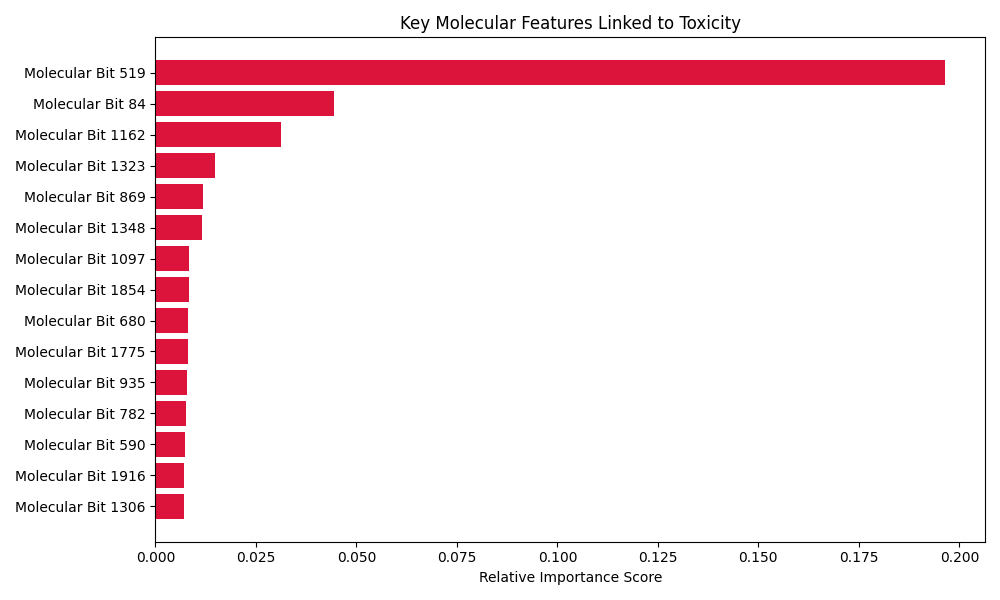

# 🧪 Drug Toxicity Prediction using Machine Learning

This project implements an end-to-end Machine Learning pipeline to predict the toxicity of chemical compounds. By leveraging the **Tox21 dataset**, the model identifies potential "red flags" in molecular structures that indicate toxicity risk, specifically focusing on the **NR-AR (Androgen Receptor)** pathway.

## 🚀 Key Features
- **High Accuracy:** Achieved a **97.66% accuracy** score using XGBoost.
- **Cheminformatics Pipeline:** Converts SMILES strings into 2048-bit Morgan Fingerprints (ECFP4) using RDKit.
- **Interpretability:** Includes feature importance analysis to identify structural alerts in molecules.
- **Interactive UI:** A Streamlit-based web interface for real-time toxicity prediction.

## 🛠️ Tech Stack
- **Languages:** Python
- **ML Frameworks:** Scikit-learn, XGBoost
- **Cheminformatics:** RDKit
- **Visualization:** Matplotlib, Seaborn
- **Web App:** Streamlit

## 📊 Model Performance & Analysis
The model was trained on ~7,200 compounds. Below is the feature importance chart showing the top molecular bits that contribute to toxicity:



## 💻 How to Run Locally

### 1. Clone the repository
```bash
git clone [https://github.com/YOUR_USERNAME/Drug-Toxicity-Predictor-ML.git](https://github.com/YOUR_USERNAME/Drug-Toxicity-Predictor-ML.git)
cd Drug-Toxicity-Predictor-ML
